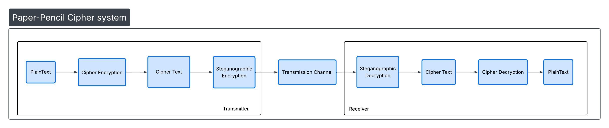

# The Overall Workflow of the Paper-Pencil Crypto-scheme



# Detailed Workflow with an example

### Step 1: **Encrypt the plain text First (Level 1 encryption)**

Using Classical encryption schemes: MHKC/AES with crypto secret key K
```
"HELLO" → [Encryption] → "Xk9mP"
```

### Step 2: ** Steganographic Encryption (Level 2 encryption)** 

Security through obscurity / Grid hiding technique

**Fill Grid with Random Letters encrypted text from Step 1**

```
X Q Z M P T R N S V B W K D F G C Y A I U E
K R X N A D M L P Q S Z T Z B F Y W C V G U  ← 'X' hidden here
F Y k W S C Q N B M K P R T Z A D V L G I H  ← 'k' hidden here  
J U 9 m P I V N T Q R S W V X B A F D C H T  ← '9mP' hidden here
Z M K P N S T Q R W X B A D F C V Y G U E I
Q T W R S B N K M P L A X Z Y D F V G C H U
... (assume 100 more rows of random letters!)
```

### Step 3: **Generate Secret Key S**

According to the paper, the secret key contains:

Secret Key S = {
  1. Stencil Set SRl (chosen shapes)
  2. Bijection function g (maps partitions to stencils)
  3. MHKC/AES crypto secret key K
  4. Permutation σ 
  5. Starting position
  ...
}

For this example,
```
Secret Key S = {
  1. Stencil Set SRl = {"L-shape"}
  2. Starting_coordinates: {(2,3)},
  3. Partition: [1, 1, 3], --> 'X', 'k', '9mP'
  4. Reading_order: "Top-to-bottom, left-to-right",
  5. MHKC/AES crypto secret key K
}
```

### Step 4: **Transmission/Reception channel - Communication network**
 **The grid** (as byte stream over network(Byte stream implementation) or as physical paper through fax (OCR implementation))


### Step 5: **Steganographic Decryption (Level 1 decryption) **
  Input: 
    1. Obscure Grid
    2. Assume the receiver already has : **The secret key S** (stencil indices/coordinates + crypto key)

  #### Camera zoom based OCR technique:
  Assume the Grid is printed on a paper, using Computer vision techniques, detect the overall grid and employ the camera to extract the cipher text.
  
  For this example:
  ```
  **Camera** uses those coordinates to zoom to specific grid positions

  **OCR** reads characters at each position → collects "Xk9mP"
  ```
  #### Byte stream implementation:
  The grid is stored in a memory region and we employ classical arrays/pointer mechanism and determine the cipher text.


  Output:
    Cipher text - "Xk9mP"

### Step 6: **Decrypt the Cipher text (Level 2 decryption) **

Using Classical decryption schemes: MHKC/AES with crypto secret key K

"Xk9mP" → [Decryption] → "HELLO"


